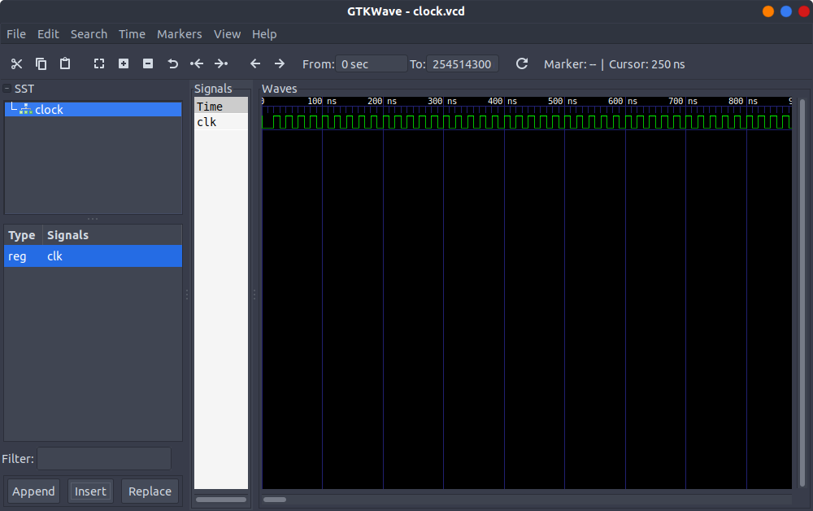

# vhdl
learning and practice of vhsic hardware description language

## VHDL using ghdl

### Steps to execute (hello_world programm):

1. compile the file -> analysis of a design file in vhdl terms. Run:
   ```
   ghdl -a helloworld.vhdl
   ```
2. Run:  
   ```
   ghdl -e hello_world
   ```
   Option -e means elaborate which is used to build a design, with the hello_world entity at the top of the hierarchy

3. Lastly, launch simulation running:
   ```
   ghdl -r hello_world
   ```
   The result shpuld be outputed to the screen and should look something like:
   ```
   Hello world!
   ```

### Steps for the adder:

1. compile as previously but this time you will need to do it with both the source and the test bench file. Run:
	```
	ghdl -a adder.vhdl
	ghdl -a adder_tb.vhdl
	```

2. Run the test bench:
	```
	ghdl -r adder_tb
	```
3. Note that if the design is complex and you need to inspect carefully the signals, you can dump sigan values in several formats:
https://ghdl.readthedocs.io/en/latest/using/Simulation.html#export-waves and visualize it with a wave viewer such as GtkWave: http://gtkwave.sourceforge.net/ to be able to use GtkViewer you should first simulate your design and dump a waveform, for example (vcd format):
	```
	ghdl -r adder_tb --vcd=adder.vcd
	```  
	And then view the dumped file:
	```
	gtkwave adder.vcd
	```
### Steps for the clock module:
1. The clock module is a very simple one, but we are going to be using it very often so we need to understand it.
2. To compile these codes , when using the IEEE library you may have to introduce the following flag ```--ieee=synopsys```
3. When analysing the .vcd file with gtkwave you should have something like the following:  

